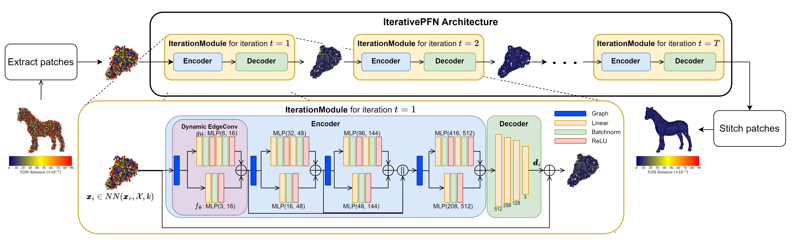

```The official implementation of our paper titled "IterativePFN: True Iterative Point Cloud Filtering". Please reach out in case you encounter issues with the setup.```

# IterativePFN: True Iterative Point Cloud Filtering
Dasith de Silva Edirimuni, Xuequan Lu, Zhiwen Shao, Gang Li, Antonio Robles-Kelly, Ying He

Paper: [ArXiv](https://arxiv.org/abs/2304.01529)

Abstract: The quality of point clouds is often limited by noise introduced during their capture process. Consequently, a fundamental 3D vision task is the removal of noise, known as point cloud filtering or denoising. State-of-the-art learning based methods focus on training neural networks to infer filtered displacements and directly shift noisy points onto the underlying clean surfaces. In high noise conditions, they iterate the filtering process. However, this iterative filtering is only done at test time and is less effective at ensuring points converge quickly onto the clean surfaces. We propose IterativePFN (iterative point cloud filtering network), which consists of multiple IterationModules that model the true iterative filtering process internally, within a single network. We train our IterativePFN network using a novel loss function that utilizes an adaptive ground truth target at each iteration to capture the relationship between intermediate filtering results during training. This ensures that the filtered results converge faster to the clean surfaces. Our method is able to obtain better performance compared to state-of-the-art methods. The source code can be found at: https://github.com/ddsediri/IterativePFN.


## Install required software
Please run the following pip and conda install commands:
```
conda create -n newenv2023 python=3.7
conda activate newenv2023
conda install pytorch==1.11.0 torchvision==0.12.0 torchaudio==0.11.0 cudatoolkit=11.3 -c pytorch
conda install -c fvcore -c iopath -c conda-forge fvcore iopath
conda install -c bottler nvidiacub
conda install pytorch3d -c pytorch3d
conda install pyg -c pyg
pip install pytorch-lightning==1.7.6
pip install point-cloud-utils==0.27.0
pip install plyfile
pip install pandas
```

**Please refer to the "How to run" section for either testing a pretrained network or training a new one.**

We have tested our networks with the following setup:
```
Python 3.7
Ubuntu 22.04
CUDA 11.3
PyTorch 1.11.0
PyTorch3D 0.7.1
PyG 2.1.0
```
For faster training, we use a SLURM cluster with 3-4 NVIDIA A100 GPUs and a batch size of 16. Please update your respective config settings according to your resources.

## Download dataset + pre-trained models

Please download the training and testing datasets and the pretrained model by following this link: [located here](https://drive.google.com/file/d/1-TvHy3bvq8X1vI0ztwmmubDqhngRLQDu/view?usp=drive_link) and downloading ```data_and_ckpt.zip```.

Thereafter, unzip ```data_and_ckpt.zip``` and place the contents of the ```/data_and_ckpt``` folder, i.e., the ```/data``` and ```/pretrained``` folders, directly within the root folder where the bash scripts are placed.

## How to run

### Train the network
Please make sure ```launcher_train.sh``` has execute permissions and that the ```data``` folder is correctly placed in the root directory. Thereafter, run the following command:
```
./launcher_train.sh
```
The folder corresponding to the training run with trained models will appear within ```./logs```. 

### Run inference only (without training a new network)
Please make sure ```launcher_test.sh``` has execute permissions and that the ```/data``` and ```/pretrained``` folders are correctly placed in the root directory. Thereafter, run the following command:
```
./launcher_test.sh
```

The evaluation results will be displayed in the terminal. You may further analyse the code within ```Evaluate.py```. The filtered output will be found at ```./data/results```. We use the Chamfer and Point2Mesh distances for our results tables and visualizations (see below).

### Results
Here is a heat-map visualization of P2M results. Please note that for the results tables, we use bidirectional P2M results (average of each point to nearest mesh triangle and each mesh triangle to nearest point). However, for the heat-map, we only use point-wise P2M results (distance of each point to nearest mesh triangle), consistent with previous works such as ScoreDenoise by Luo and Hu. Also, all metrics are calculated using PyTorch3D implementations of the corresponding metrics.

```Results on the 2% noise scale with synthetic Gaussian noise.```

## Acknowledgement and citation
Our code is partially based on ``Score-Based Point Cloud Denoising`` by Shitong Luo and Wei Hu. Kudos to them for their excellent implementation and resources. Please check their GitHub repo [here](https://github.com/luost26/score-denoise).

If you find our paper interesting and our code useful, please cite our paper with the following BibTex citation:
```
@InProceedings{de_Silva_Edirimuni_2023_CVPR,
    author    = {de Silva Edirimuni, Dasith and Lu, Xuequan and Shao, Zhiwen and Li, Gang and Robles-Kelly, Antonio and He, Ying},
    title     = {IterativePFN: True Iterative Point Cloud Filtering},
    booktitle = {Proceedings of the IEEE/CVF Conference on Computer Vision and Pattern Recognition (CVPR)},
    month     = {June},
    year      = {2023},
    pages     = {13530-13539}
}
```